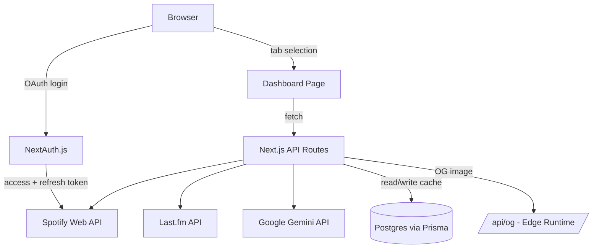

# Spotify Analytics Dashboard

A full-stack analytics dashboard for your Spotify listening habits — top tracks and artists, listening duration breakdowns, mood/genre analysis, AI-generated listening summaries, and Last.fm-powered recommendations.

**Live demo:** [spotify-dashboard-mu.vercel.app](https://spotify-dashboard-mu.vercel.app)

---

## Features

- **Spotify OAuth** via NextAuth.js, with a custom refresh-token flow to keep sessions alive past the ~1 hour Spotify access token lifetime
- **Top Tracks & Artists** across configurable time ranges (last 4 weeks / 6 months / all time)
- **Listening Duration Chart** — bar chart breakdown of total listening time per track
- **Recently Played** — day-grouped history feed
- **Mood & Genre Radar Chart** — tag-based mood analysis powered by Last.fm (see [Case Study](#case-study) for why this isn't built on Spotify's own audio-features endpoint)
- **AI Listening Summaries** — daily-cached natural-language recaps of your listening activity, generated with Google Gemini
- **"For You" Recommendations** — similar artists/tracks sourced from Last.fm, seeded from your top tracks and artists, with direct "Play on Spotify" links
- **Shareable OG Card** — auto-generated Open Graph image card summarizing your top tracks/artists, built with `@vercel/og` on the Edge runtime
- **Cascading entrance animations** (Framer Motion) and a custom animated landing page heading (anime.js)
- Fully responsive, dark-themed UI styled to match Spotify's own visual language

## Tech Stack

| Layer            | Tech                                                             |
| ---------------- | ---------------------------------------------------------------- |
| Framework        | Next.js 14 (App Router), TypeScript                              |
| Styling          | Tailwind CSS v4                                                  |
| Auth             | NextAuth.js (Spotify OAuth)                                      |
| Database         | PostgreSQL (Supabase) via Prisma ORM                             |
| APIs             | Spotify Web API, Last.fm API, Google Gemini (`gemini-2.5-flash`) |
| Charts           | Recharts                                                         |
| Animation        | Framer Motion, anime.js                                          |
| Image generation | `@vercel/og`                                                     |
| Hosting          | Vercel                                                           |

## Architecture

Each dashboard tab (Top Tracks, Top Artists, Recently Played, For You) triggers its own API route, which fetches fresh data from Spotify/Last.fm/Gemini as needed and reads/writes a Postgres cache (via Prisma) for anything expensive to regenerate — AI recaps and recommendations are cached for a set window instead of recomputed on every request.

## Case Study

### The problem

Spotify significantly restricted its Web API for apps created after **November 2024**, and again during a **February 2026** platform migration. Several features originally planned for this project depend on endpoints that are no longer available to apps in Development Mode:

- The **Audio Features API** (`/v1/audio-features`) — needed for genre/mood analysis — now returns `403 Forbidden`.
- The **Recommendations API** (`/v1/recommendations`) — the natural choice for a "For You" tab — is unavailable for the same reason.
- The **30-second preview URL** field, previously returned on track objects, is no longer populated.
- As of the February 2026 migration, **writing to playlists** (`POST /v1/playlists/{id}/tracks`) began failing with `403 Forbidden` for Development Mode apps specifically — confirmed via Spotify's developer community as a platform-side restriction, not an application bug.

### Decisions

Rather than abandon these features, each restriction was diagnosed and worked around:

- **Mood/genre analysis** was rebuilt on **Last.fm's tag data** instead of Spotify's audio features, feeding a Recharts radar chart.
- **Recommendations** were rebuilt on **Last.fm's `artist.getsimilar` / `track.getsimilar`** endpoints, seeded from the user's own top tracks and artists, with deduplication and known-item filtering, then cross-referenced back to Spotify's `/v1/search` endpoint to recover playable track IDs for direct "Play on Spotify" links.
- The **preview player** was dropped in favor of those same "Play on Spotify" links, once it was confirmed `preview_url` was unrecoverable.
- A full **save-to-Spotify playlist pipeline** was built and correctly wired end-to-end — token refresh, playlist creation, track addition — before the `403` on adding tracks was isolated, through careful elimination (manual token/payload tests succeeded outside the app; only in-app calls failed) to a platform-side write restriction rather than a code defect. The feature was ultimately cut in favor of the simpler, working "Play on Spotify" link pattern, once further debugging confirmed the block was outside the app's control.
- A related but separate bug was found and fixed along the way: the **NextAuth refresh-token flow had silently regressed** — only the access token was ever being persisted, so sessions were failing to refresh past their ~1 hour lifetime. This was root-caused independently of the playlist-write issue and fixed in the `jwt` callback.

### Result

A dashboard that works within Spotify's current API constraints without silently degrading — every removed or blocked feature was replaced with a working equivalent (Last.fm-based recommendations and mood analysis, direct Spotify links instead of embedded playback) rather than left broken or hidden. The debugging process itself — separating "my code is wrong" from "the platform changed under me" — is arguably the most representative engineering work in the project.

---

## Roadmap

Built over a 10-week self-directed project plan: OAuth and core data views, AI-generated recaps, a recommendation engine, UX polish (responsive design, animations, error/loading states), and production launch.

## License

MIT
